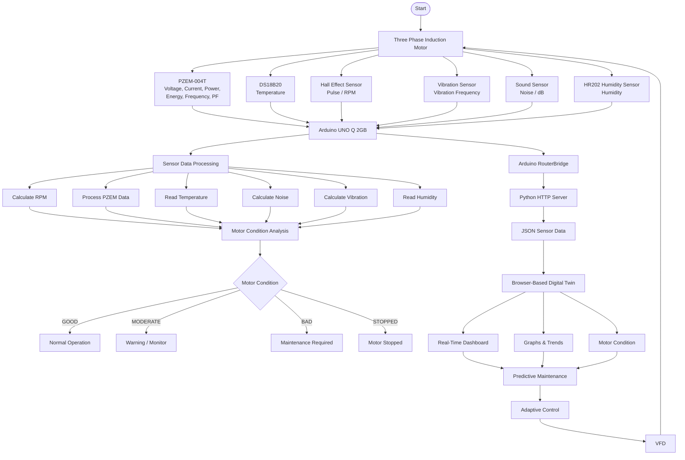

# TAC-Dynamics
AIoT-based predictive maintenance and digital twin system for industrial induction motors using Arduino UNO Q, multi-sensor monitoring, real-time visualization, and VFD-based adaptive control.
## System Flowchart

